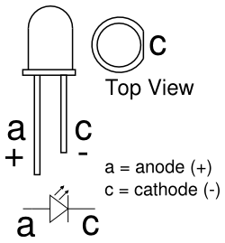

# Basic C template, blink a LED

1. Create a new project `blink` in PlatformIO, select your ESP board, such as `Espressif ESP32 Dev Module`, and keep `Arduino` framework.

   > The Arduino framework is built on top of C and C++ programming languages. The main application code includes the `setup()` and `loop()` functions, where `setup()` is executed once during initialization, and `loop()` is executed repeatedly.
   >
   > The core library `Arduino.h` includes essential functionalities such as `digitalWrite()`, `digitalRead()`, `analogRead()`, `delay()`, and more. These functions are used for basic input/output operations and time delays.
   >
   > Arduino APIs for ESP's peripherals are [described here](https://espressif-docs.readthedocs-hosted.com/projects/arduino-esp32/en/latest/libraries.html#apis).

2. Copy/paste the following code to your `BLINK > src > main.cpp` source file.

    ```c
    /*
     * Blink
     *
     * Turns on and off an LED and send a message to VS Code repeatedly.
     */

    #include <Arduino.h>

    // Set pin number of your LED
    #define PIN_LED 2

    // Put your setup code here, to run once
    void setup()
    {
        // Initialize LED digital pin as an output
        pinMode(PIN_LED, OUTPUT);
        // Tur off the LED
        digitalWrite(PIN_LED, LOW);

        // Set the communication symbol rate
        Serial.begin(115200);
    }

    // Put your main code here, to run repeatedly
    void loop()
    {
        Serial.println("LED is on");  // Transmit string
        digitalWrite(PIN_LED, HIGH);  // Turn on the LED
        delay(250);                   // Wait for 250 ms
        Serial.println("LED is off");
        digitalWrite(PIN_LED, LOW);   // Turn off the LED
        delay(750);                   // Wait for 750 ms
    }
    ```

3. The code combine both output LED control and UART communication from ESP microcontroller and VS Code. To ensure the correct receiption, add the following line to the `BLINK > platformio.ini` configuration file:

   ```shell
   monitor_speed = 115200
   ```

4. The handy shortcuts for building and uploading the code is available on the footer taskbar. Compile (build) the project, then upload it to ESP board, and open the Serial monitor to receive messages from the board.

## ESP32 pinout and Breadboards

The ESP32 microcontroller board has a number of **GPIO (General Purpose Input/Output) pins** that can be used for various purposes, such as digital input and output, analog input, communication interfaces (e.g., UART, SPI, I2C), PWM (Pulse Width Modulation) output, and more. The exact pinout may vary depending on the specific development board or module you are using.

The pinout of the 30-pin [ESP32 DevKit ESP32-WROOM](https://circuits4you.com/2018/12/31/esp32-devkit-esp32-wroom-gpio-pinout/) board is here:

   

   

The pinout of the 38-pin ESP32 DevKitC board is here:

   

   

The primary purpose of a **breadboard** (also known as a protoboard or solderless breadboard) is to facilitate the construction and testing of electronic circuits. It allows students to create complex circuits without soldering components together. This is especially important for beginners who are learning electronics and want to experiment with different designs because components can be easily inserted and removed, making it an ideal platform for prototyping and trying out various circuit configurations quickly. Also, breadboards provide a clear visual representation of the circuit layout.

A typical breadboard has rows and columns of interconnected metal clips or sockets, forming a grid. Most breadboards are divided into two halves, usually denoted as the "top" and "bottom" sections. Along the sides of the breadboard, there are usually two long strips, often colored red and blue, which are called the *power rails* used to provide power to your circuits. The red rail is for the positive supply voltage (VCC), and the blue rail is for ground (GND).

The main grid consists of multiple rows and columns. Each row typically contains five interconnected sockets, labeled A, B, C, D, and E. Each column contains interconnected sockets, and columns are often labeled with numbers (1-30, for example). The five sockets within a row are electrically connected. The same goes for sockets within a column; they are electrically connected. The points where the rows and columns intersect are where you can insert and connect components. For example, inserting a wire or component lead into a socket in row "A" and another in column "5" will create an electrical connection between them. For other details see [this](https://computers.tutsplus.com/tutorials/how-to-use-a-breadboard-and-build-a-led-circuit--mac-54746) breadboard description or [that one](https://www.sciencebuddies.org/science-fair-projects/references/how-to-use-a-breadboard).

   

## LEDs

LED (Light Emitting Diode) is a semiconductor device that emits light when an electric current passes through it. LED consists of two leads or pins Anode and Cathode, and when connecting an LED to a power source, it's important to observe the correct polarity.

For an active-low LED:

* The GPIO pin is connected to the cathode (shorter lead) of the LED.
* The the anode (longer lead) is connected to resistor and VCC (3.3V).
* The LED lights up when the GPIO pin is set to LOW (0).

For an active-high LED:

* The GPIO pin is connected to the anode (longer lead) of the LED.
* The cathode (shorter lead) is connected to resistor and GND.
* The LED lights up when the GPIO pin is set to HIGH (1).

   

   

1. Use breadboard, jumper wires and connect two LEDs and resistors to ESP32 GPIO pins in active-high way. Use GPIO pin numbers 22, 23.

   Alternatively, you can use a [3-pin LED](https://lednique.com/leds-with-more-than-two-pins/) with two different colours. The middle lead is a common cathos or anode

   

   > **IMPORTANT:** Ensure that you include a resistor in series with an LED!

2. Write the code for continuous blinking of all three LEDs (including the onboard one).

## Logic analyser

Connect the logic analyzer to the `Tx` pin (usually GPIO1). Launch the logic analyzer software Logic and **Start** the capture. Saleae Logic software offers a decoding feature to transform the captured signals into meaningful UART messages. Click to **+ button** in **Analyzers** part and setup **Async Serial** decoder for 115200 Bd.


> **Note:** To perform this analysis, you will need a logic analyzer such as [Saleae](https://www.saleae.com/) or [similar](https://www.amazon.com/KeeYees-Analyzer-Device-Channel-Arduino/dp/B07K6HXDH1/ref=sr_1_6?keywords=saleae+logic+analyzer&qid=1667214875&qu=eyJxc2MiOiI0LjIyIiwicXNhIjoiMy45NSIsInFzcCI6IjMuMDMifQ%3D%3D&sprefix=saleae+%2Caps%2C169&sr=8-6) device. Additionally, you should download and install the [Saleae Logic 1](https://support.saleae.com/logic-software/legacy-software/older-software-releases#logic-1-x-download-links) software on your computer.
>
> You can find a comprehensive tutorial on utilizing a logic analyzer in this [video](https://www.youtube.com/watch?v=CE4-T53Bhu0).
