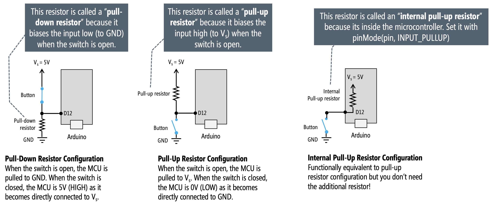

# Button

A button is a physical switch that can be pressed or released to open or close an electrical circuit. Buttons are commonly used as input devices in embedded systems to allow users to interact with electronic devices by providing a means to send signals or trigger specific actions.

Mechanical buttons can introduce noise due to bouncing (rapid opening and closing) when pressed or released. To address this, it's common to use software debouncing techniques in the microcontroller code or add external components like resistors and capacitors.

For an active-low button:

* The GPIO pin is connected to one terminal of the button.
* The other terminal is connected to GND.
* The internal (or external) pull-up resistor must be used.
* The button is considered pressed when the GPIO pin reads LOW (0).

For an active-high button:

* The GPIO pin is connected to one terminal of the button.
* The other terminal is connected to VCC (3.3V).
* The internal (or external) pull-down resistor must be used.
* The button is considered pressed when the GPIO pin reads HIGH (1).

   

   Note that, the ESP32 has built-in pull-up and pull-down resistors that can be enabled in software.

1. Use breadboard, jumper wires and connect one push button to ESP32 GPIO pin in active-low way. Use GPIO pin number 27. If there is no on-board LED, connect an external one with a resistor in series.

   

   

2. Create a new PlatformIO project for your ESP32 board and write the code when LED blinking only if push button is pressed. Use multiple LEDs or multi-color one as well.

    ```c
    #include <Arduino.h>

    #define PIN_LED 2
    #define PIN_BTN 27

    void setup()
    {
        pinMode(PIN_BTN, INPUT_PULLUP);
    }

    void loop()
    {
        if (digitalRead(PIN_BTN) == LOW) {
            // Button is pressed, implement your logic here
            // For example: digitalWrite(LED_PIN, HIGH);
        } else {
            // Button is released
        }
    }
    ```
