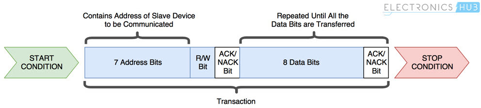

# I2C Scanner

I2C (Inter-Integrated Circuit) is a serial communication protocol designed for a two-wire interface, enabling the connection of low-speed devices such as sensors, EEPROMs, A/D and D/A converters, I/O interfaces, and other similar peripherals within embedded systems. Originally developed by Philips, this protocol has gained widespread adoption and is now utilized by nearly all major IC manufacturers.

I2C utilizes just two wires: **SCL** (Serial Clock) and **SDA** (Serial Data). Both of these wires should be connected to a resistor and pulled up to +Vdd. Additionally, I2C level shifters are available for connecting two I2C buses with different voltage levels.

In an I2C bus configuration, there is always one **Master** device and one or more **Slave** devices. Each Slave device is identified by a [unique address](https://i2c.info/).


The initial I2C specifications defined maximum clock frequency of 100 kHz. This was later increased to 400 kHz as Fast mode. There is also a High speed mode which can go up to 3.4 MHz and there is also a 5 MHz ultra-fast mode.

In idle state both lines (SCL and SDA) are high. The communication is initiated by the master device. It generates the Start condition (S) followed by the address of the slave device (SLA). If the bit 0 of the address byte was set to 0 the master device will write to the slave device (SLA+W). Otherwise, the next byte will be read from the slave device (SLA+R). Each byte is supplemented by an ACK (low level) or NACK (high level) acknowledgment bit, which is always transmitted by the device receiving the previous byte.

The address byte is followed by one or more data bytes, where each contains 8 bits and is again terminated by ACK/NACK. Once all bytes are read or written the master device generates Stop condition (P). This means that the master device switches the SDA line from low voltage level to high voltage level before the SCL line switches from [high to low](https://www.electronicshub.org/basics-i2c-communication/).



Note that, most I2C devices support repeated start condition. This means that before the communication ends with a stop condition, master device can repeat start condition with address byte and change the mode from writing to reading.

> ## Example of I2C communication
>
> **Question:** Let the following image shows several frames of I2C communication between ATmega328P and a slave device. What circuit is it and what information was sent over the bus?
>
> &nbsp;
> 
>
> **Answer:** This communication example contains a total of five frames. After the start condition, which is initiated by the master, the address frame is always sent. It contains a 7-bit address of the slave device, supplemented by information on whether the data will be written to the slave or read from it to the master. The ninth bit of the address frame is an acknowledgment provided by the receiving side.
>
> Here, the address is 184 (decimal), i.e. `101_1100-0` in binary including R/W=0. The slave address is therefore 101_1100 (0x5c) and master will write data to the slave. The slave has acknowledged the address reception, so that the communication can continue.
>
> According to the list of [I2C addresses](https://learn.adafruit.com/i2c-addresses/the-list) the device could be humidity/temp or pressure sensor. The signals were really recorded when communicating with the humidity and temperature sensor.
>
> The data frame always follows the address one and contains eight data bits from the MSB to the LSB and is again terminated by an acknowledgment from the receiving side. Here, number `2` was written to the sensor. According to the [DHT12 sensor manual](../../docs/dht12_manual.pdf), this is the address of register, to which the integer part of measured temperature is stored. (The following register contains its decimal part.)
>
> | **Memory location** | **Description** |
> | :-: | :-- |
> | 0x00 | Humidity integer part |
> | 0x01 | Humidity decimal part |
> | 0x02 | Temperature integer part |
> | 0x03 | Temperature decimal part |
> | 0x04 | Checksum |
>
> After the repeated start, the same circuit address is sent on the I2C bus, but this time with the read bit R/W=1 (185, `1011100_1`). Subsequently, data frames are sent from the slave to the master until the last of them is confirmed by the NACK value. Then the master generates a stop condition on the bus and the communication is terminated.
>
> The communication in the picture therefore records the temperature transfer from the sensor, when the measured temperature is 25.3 degrees Celsius.
>
> | **Frame #** | **Description** |
> | :-: | :-- |
> | 1 | Address frame with SLA+W = 184 (0x5c<<1 + 0) |
> | 2 | Data frame sent to the Slave represents the ID of internal register |
> | 3 | Address frame with SLA+R = 185 (0x5c<<1 + 1) |
> | 4 | Data frame with integer part of temperature read from Slave |
> | 5 | Data frame with decimal part of temperature read from Slave |

## I2C scanner

The goal of this task is to find all devices connected to the I2C bus.

1. Use breadboard, jumper wires, and connect I2C devices to ESP32 GPIO pins as follows: SDA - GPIO 21, SCL - GPIO 22, VCC - 3.3V, GND - GND.

   > **Note:** Connect the components on the breadboard only when the supply voltage/USB is disconnected! There is no need to connect external pull-up resistors on the SDA and SCL pins, because the internal ones is used.

   

   

   * Humidity/temperature [DHT12](../../docs/dht12_manual.pdf) digital sensor

   * SH1106 I2C [OLED display](https://randomnerdtutorials.com/esp32-ssd1306-oled-display-arduino-ide/) 128x64

   * Humidity/temperature/pressure [BME280](https://cdn-shop.adafruit.com/datasheets/BST-BME280_DS001-10.pdf) sensor

   * Combined module with [RTC DS3231](../../docs/ds3231_manual.pdf) (Real Time Clock) and [AT24C32](../../docs/at24c32_manual.pdf) EEPROM memory

   * [GY-521 module](../../docs/mpu-6050_datasheet.pdf) (MPU-6050 Microelectromechanical systems that features a 3-axis gyroscope, a 3-axis accelerometer, a digital motion processor (DMP), and a temperature sensor).

2. Create a new PlatformIO project for your ESP32 board and write the code to perform a scan to detect the slave addresses of connected I2C devices. Endeavor to determine the corresponding chip associated with each address. Note that UART baud rate is set to 115200, therefore you need to add a line to your `platformio.ini` config file:

    ```shell
    monitor_speed = 115200
    ```

    ```c
    #include <Arduino.h>
    #include <Wire.h>

    void setup()
    {
        Wire.begin();
        Serial.begin(115200);
        while (!Serial);

        Serial.println("Scanning I2C... ");

        for (uint8_t sla = 8; sla < 120; sla++) {
            // I2c scanner uses the return value of `Write.endTransmisstion()`
            // to see if a device did acknowledge to the address
            Wire.beginTransmission(sla);
            if (Wire.endTransmission() == 0) {  // ACK from Slave
                Serial.println(sla, HEX);
            }
        }
    }

    void loop()
    {
        // Empty forever loop
    }
    ```

3. Extend the application and provide the slave addresses oth in hexadecimal and decimal representation. Print the number of connected devices.

4. Connect the logic analyzer to the I2C and Tx wires. Launch the logic analyzer software Logic and Start the capture. Add two protocol analyzers: **I2C** and **Async Serial**.

5. Transform the output of the I2C scanner application into a hexadecimal table format, as illustrated in the example below. Please be aware that the term `RA` signifies I2C addresses that are [reserved](https://www.pololu.com/file/download/UM10204.pdf?file_id=0J435) and not available for use with slave circuits.

    ```Makefile
    Scanning I2C...

          .0 .1 .2 .3 .4 .5 .6 .7 .8 .9 .a .b .c .d .e .f
    0x0.: RA RA RA RA RA RA RA RA -- -- -- -- -- -- -- --
    0x1.: -- -- -- -- -- -- -- -- -- -- -- -- -- -- -- --
    0x2.: -- -- -- -- -- -- -- -- -- -- -- -- -- -- -- --
    0x3.: -- -- -- -- -- -- -- -- -- -- -- -- 3c -- -- --
    0x4.: -- -- -- -- -- -- -- -- -- -- -- -- -- -- -- --
    0x5.: -- -- -- -- -- -- -- -- -- -- -- -- 5c -- -- --
    0x6.: -- -- -- -- -- -- -- -- -- -- -- -- -- -- -- --
    0x7.: -- -- -- -- -- -- -- -- RA RA RA RA RA RA RA RA

    2 device(s) detected
    ```
