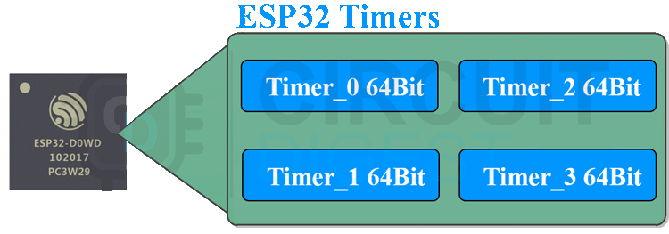

# Timers

A timer (or counter) is an integral hardware component in a microcontroller unit designed for measuring time-based events. Timers count from 0 to (2^n -1), where `n` being the number of bits of the counter. Thus, an 8-bit counter will count from 0 to 255, a 16-bit counter will count from 0 to 65535, and so on.

ESP32 has two timer groups, each group containing two 64-bit timers. Thus, there are four 64-bit timers in total, designated as Timer0, Timer1, and Timer2. They are all 64-bit generic timers based on 16-bit prescalers and 64-bit up/down counters which are capable of being auto-reloaded.



Prescalers help divide the base clock frequency. ESP32 generally has a base clock frequency of 80 MHz and it can be a bit too high. Having a 16-bit pre-scaler means that you can divide the base clock frequency by at least 2 and by as much as 65536. 80 MHz/65535 = 1.22 KHz. Now, this means that the frequency of a timer can be adjusted from 1.22 KHz to 80 MHz (of course in discrete steps). This wide range of frequency, along with the fact that these are 64-bit timers ensures that almost any interval is possible with ESP32 timers.

The timer interrupts are the best way to run non-blocking functions at a certain interval. For that, we can configure and attach a particular timer interrupt to a specific Interrupt Service Routine or ISR.

## Interrupts

Interrupts can be triggered by both internal and external devices within the microcontroller unit (MCU). It represents a signal **Interrupt request** sent to the processor by hardware or software, signifying an event that requires immediate attention. When an interrupt is triggered, the controller finishes executing the current instruction and proceeds to execute an **Interrupt Service Routine (ISR)** or Interrupt Handler. ISR tells the processor or controller what to do when the [interrupt occurs](https://www.tutorialspoint.com/embedded_systems/es_interrupts.htm). After the interrupt code is executed, the program continues exactly where it left off.


Interrupts can be set up for events such as a counter's value, a pin changing state, receiving data through serial communication, or when the Analog-to-Digital Converter has completed the conversion process.

1. Create a new PlatformIO project for your ESP32 board and write the code to blink the LED with a period of 1 sec. Use the following template:

    ```c
    #include <Arduino.h>

    // Set the timer interval in milliseconds
    const int timerInterval = 1000;  // 1000 milliseconds = 1 second

    // Create an object for the timer
    hw_timer_t *timer = NULL;

    // Timer ISR (Interrupt Service Routine)
    void IRAM_ATTR timer_isr()
    {
        // ADD YOUR CODE HERE
    }

    void setup()
    {
        // Create a timer object: Timer 0, divider 80 (prescaler), count up mode
        timer = timerBegin(0, 80, true);
        // Attach the ISR
        timerAttachInterrupt(timer, &timer_isr, true);
        // Set the timer interval in microseconds
        timerAlarmWrite(timer, timerInterval * 1000, true);
        // Enable the timer
        timerAlarmEnable(timer);

        // ADD YOUR CODE HERE
    }

    void loop()
    {
        // Your main code can run here without blocking the timer
    }
    ```
